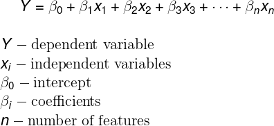
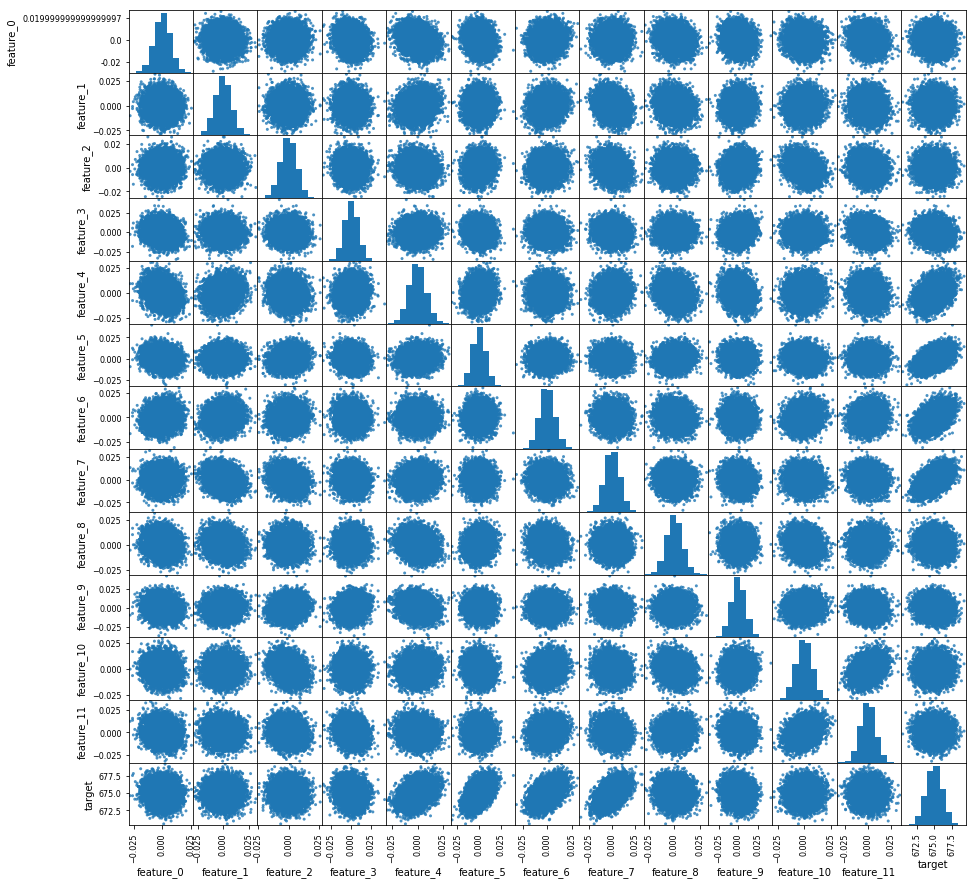
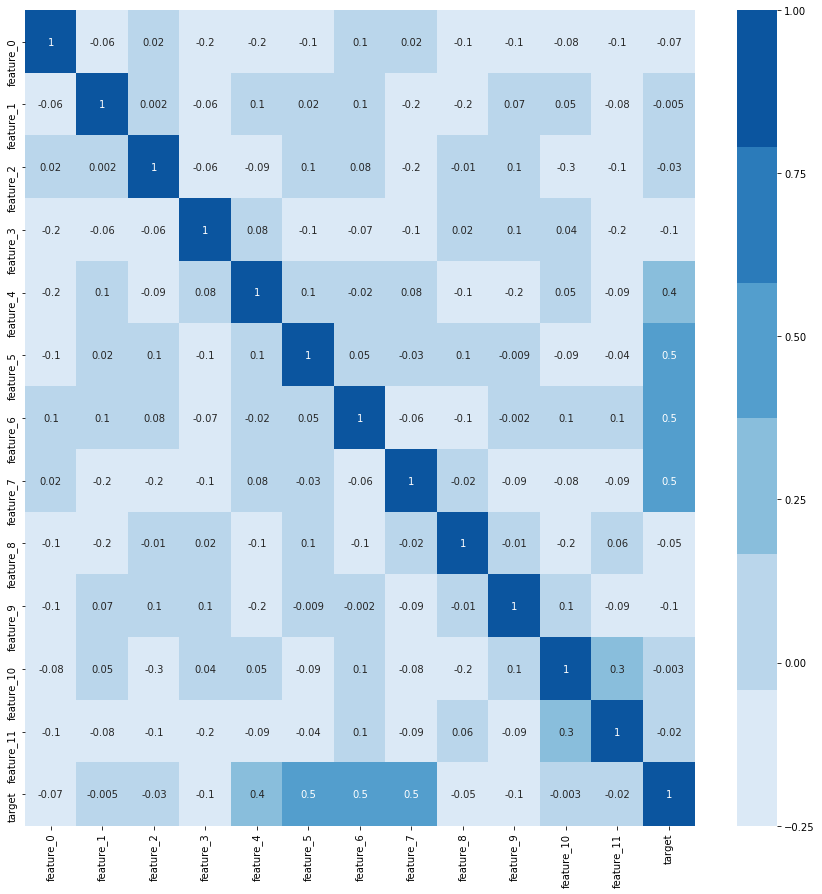
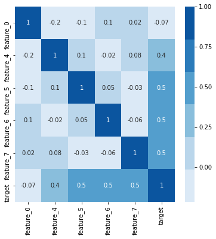
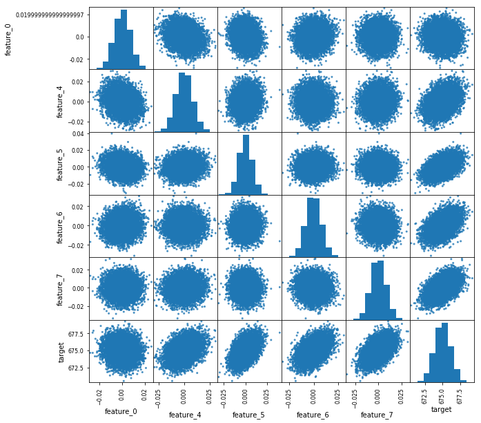

### Questions

### Objectives
YWBAT
* compare and contrast multiple linear regression with linear regression
* interpret a linear regression equation
* interpret a lienar regression summary from statsmodels.api.ols

### Multiple Linear Regression Equation - Let's discuss this!




```python
import pandas as pd
import numpy as np

import matplotlib.pyplot as plt
import seaborn as sns
```


```python
df = pd.read_csv("sample_data.csv")
df.head()
```


<div>
<style scoped>
    .dataframe tbody tr th:only-of-type {
        vertical-align: middle;
    }

    .dataframe tbody tr th {
        vertical-align: top;
    }

    .dataframe thead th {
        text-align: right;
    }
</style>
<table border="1" class="dataframe">
  <thead>
    <tr style="text-align: right;">
      <th></th>
      <th>feature_0</th>
      <th>feature_1</th>
      <th>feature_2</th>
      <th>feature_3</th>
      <th>feature_4</th>
      <th>feature_5</th>
      <th>feature_6</th>
      <th>feature_7</th>
      <th>feature_8</th>
      <th>feature_9</th>
      <th>feature_10</th>
      <th>feature_11</th>
      <th>target</th>
    </tr>
  </thead>
  <tbody>
    <tr>
      <th>0</th>
      <td>0.001821</td>
      <td>-0.001319</td>
      <td>0.005859</td>
      <td>0.021955</td>
      <td>-0.001948</td>
      <td>-0.003966</td>
      <td>0.009683</td>
      <td>-0.004639</td>
      <td>-0.008645</td>
      <td>0.012157</td>
      <td>0.002444</td>
      <td>0.003559</td>
      <td>675.850993</td>
    </tr>
    <tr>
      <th>1</th>
      <td>-0.004294</td>
      <td>-0.001573</td>
      <td>0.005556</td>
      <td>0.004918</td>
      <td>0.006706</td>
      <td>-0.011201</td>
      <td>0.005486</td>
      <td>-0.005410</td>
      <td>-0.014989</td>
      <td>0.004123</td>
      <td>0.000703</td>
      <td>-0.001232</td>
      <td>673.974262</td>
    </tr>
    <tr>
      <th>2</th>
      <td>-0.002046</td>
      <td>-0.006717</td>
      <td>0.012271</td>
      <td>0.000074</td>
      <td>-0.006127</td>
      <td>0.003216</td>
      <td>-0.012119</td>
      <td>-0.005530</td>
      <td>0.010074</td>
      <td>0.003767</td>
      <td>-0.001017</td>
      <td>-0.001816</td>
      <td>673.358685</td>
    </tr>
    <tr>
      <th>3</th>
      <td>0.002768</td>
      <td>0.004881</td>
      <td>-0.003340</td>
      <td>-0.003184</td>
      <td>-0.000521</td>
      <td>0.003457</td>
      <td>0.002025</td>
      <td>-0.012864</td>
      <td>0.002319</td>
      <td>0.000966</td>
      <td>0.005019</td>
      <td>0.008129</td>
      <td>674.325936</td>
    </tr>
    <tr>
      <th>4</th>
      <td>-0.004281</td>
      <td>-0.002687</td>
      <td>0.014785</td>
      <td>-0.004035</td>
      <td>0.009604</td>
      <td>0.008402</td>
      <td>0.001927</td>
      <td>0.004632</td>
      <td>-0.006889</td>
      <td>0.005027</td>
      <td>-0.007444</td>
      <td>-0.010401</td>
      <td>677.151990</td>
    </tr>
  </tbody>
</table>
</div>


### let's investigate our data first!


```python
# let's use the scatter matrix functionality to view our data

pd.plotting.scatter_matrix(df, figsize=(15, 15), diagonal='hist', alpha=0.8)
plt.show()
```





### Let's look at a heatmap of the covariance!


```python
corr = df.corr()
plt.figure(figsize=(15, 15))
sns.heatmap(corr, annot=True, fmt='.1g', cmap=sns.color_palette('Blues'))
plt.show()
```





### how do we create a linreg model in statsmodels?


```python
import statsmodels.api as sm
```


```python
# split x and y data
y = df["target"]
x = df.drop("target", axis=1)
```


```python
# we want an ols model with a constant
X = sm.add_constant(x)
```


```python
linreg = sm.OLS(y, X).fit()
linreg.summary()
```


<table class="simpletable">
<caption>OLS Regression Results</caption>
<tr>
  <th>Dep. Variable:</th>         <td>target</td>      <th>  R-squared:         </th> <td>   0.808</td> 
</tr>
<tr>
  <th>Model:</th>                   <td>OLS</td>       <th>  Adj. R-squared:    </th> <td>   0.808</td> 
</tr>
<tr>
  <th>Method:</th>             <td>Least Squares</td>  <th>  F-statistic:       </th> <td>   3497.</td> 
</tr>
<tr>
  <th>Date:</th>             <td>Wed, 08 May 2019</td> <th>  Prob (F-statistic):</th>  <td>  0.00</td>  
</tr>
<tr>
  <th>Time:</th>                 <td>21:47:19</td>     <th>  Log-Likelihood:    </th> <td> -7332.2</td> 
</tr>
<tr>
  <th>No. Observations:</th>      <td> 10000</td>      <th>  AIC:               </th> <td>1.469e+04</td>
</tr>
<tr>
  <th>Df Residuals:</th>          <td>  9987</td>      <th>  BIC:               </th> <td>1.478e+04</td>
</tr>
<tr>
  <th>Df Model:</th>              <td>    12</td>      <th>                     </th>     <td> </td>    
</tr>
<tr>
  <th>Covariance Type:</th>      <td>nonrobust</td>    <th>                     </th>     <td> </td>    
</tr>
</table>
<table class="simpletable">
<tr>
       <td></td>         <th>coef</th>     <th>std err</th>      <th>t</th>      <th>P>|t|</th>  <th>[0.025</th>    <th>0.975]</th>  
</tr>
<tr>
  <th>const</th>      <td>  675.0002</td> <td>    0.005</td> <td> 1.34e+05</td> <td> 0.000</td> <td>  674.990</td> <td>  675.010</td>
</tr>
<tr>
  <th>feature_0</th>  <td>   -2.3001</td> <td>    0.782</td> <td>   -2.939</td> <td> 0.003</td> <td>   -3.834</td> <td>   -0.766</td>
</tr>
<tr>
  <th>feature_1</th>  <td>   -0.0614</td> <td>    0.665</td> <td>   -0.092</td> <td> 0.926</td> <td>   -1.365</td> <td>    1.242</td>
</tr>
<tr>
  <th>feature_2</th>  <td>    0.9610</td> <td>    0.847</td> <td>    1.134</td> <td> 0.257</td> <td>   -0.700</td> <td>    2.622</td>
</tr>
<tr>
  <th>feature_3</th>  <td>   -0.6649</td> <td>    0.627</td> <td>   -1.061</td> <td> 0.289</td> <td>   -1.894</td> <td>    0.564</td>
</tr>
<tr>
  <th>feature_4</th>  <td>   38.4293</td> <td>    0.680</td> <td>   56.512</td> <td> 0.000</td> <td>   37.096</td> <td>   39.762</td>
</tr>
<tr>
  <th>feature_5</th>  <td>   69.9128</td> <td>    0.717</td> <td>   97.564</td> <td> 0.000</td> <td>   68.508</td> <td>   71.317</td>
</tr>
<tr>
  <th>feature_6</th>  <td>   70.1359</td> <td>    0.683</td> <td>  102.737</td> <td> 0.000</td> <td>   68.798</td> <td>   71.474</td>
</tr>
<tr>
  <th>feature_7</th>  <td>   73.8832</td> <td>    0.680</td> <td>  108.630</td> <td> 0.000</td> <td>   72.550</td> <td>   75.216</td>
</tr>
<tr>
  <th>feature_8</th>  <td>   -0.7158</td> <td>    0.700</td> <td>   -1.022</td> <td> 0.307</td> <td>   -2.089</td> <td>    0.657</td>
</tr>
<tr>
  <th>feature_9</th>  <td>   -0.5132</td> <td>    0.613</td> <td>   -0.838</td> <td> 0.402</td> <td>   -1.714</td> <td>    0.688</td>
</tr>
<tr>
  <th>feature_10</th> <td>    1.5805</td> <td>    0.762</td> <td>    2.075</td> <td> 0.038</td> <td>    0.087</td> <td>    3.074</td>
</tr>
<tr>
  <th>feature_11</th> <td>   -0.2789</td> <td>    0.694</td> <td>   -0.402</td> <td> 0.688</td> <td>   -1.639</td> <td>    1.081</td>
</tr>
</table>
<table class="simpletable">
<tr>
  <th>Omnibus:</th>       <td> 6.359</td> <th>  Durbin-Watson:     </th> <td>   1.979</td>
</tr>
<tr>
  <th>Prob(Omnibus):</th> <td> 0.042</td> <th>  Jarque-Bera (JB):  </th> <td>   6.137</td>
</tr>
<tr>
  <th>Skew:</th>          <td> 0.039</td> <th>  Prob(JB):          </th> <td>  0.0465</td>
</tr>
<tr>
  <th>Kurtosis:</th>      <td> 2.907</td> <th>  Cond. No.          </th> <td>    196.</td>
</tr>
</table>


```python
linreg.params
```


    const         675.000217
    feature_0      -2.300050
    feature_1      -0.061403
    feature_2       0.961006
    feature_3      -0.664922
    feature_4      38.429258
    feature_5      69.912759
    feature_6      70.135916
    feature_7      73.883159
    feature_8      -0.715803
    feature_9      -0.513224
    feature_10      1.580495
    feature_11     -0.278885
    dtype: float64


### Running a straight Linear Regression Model with no pre-processing
* this is not to do anything more than to get a feel for the data
* I personally use this as a baseline
* Let's get through the rest

### Which features should be eliminated?
feature_1, feature_2, feature_3, feature_8, feature_9, feature_11

### Let's drop them and see what happens


```python
# split x and y data
y = df["target"]
x = df.drop(["target", "feature_1", "feature_2", "feature_3", "feature_8", "feature_9", "feature_11"], axis=1)
```


```python
X = sm.add_constant(x)
linreg = sm.OLS(y, X).fit()
linreg.summary()
```


<table class="simpletable">
<caption>OLS Regression Results</caption>
<tr>
  <th>Dep. Variable:</th>         <td>target</td>      <th>  R-squared:         </th> <td>   0.808</td> 
</tr>
<tr>
  <th>Model:</th>                   <td>OLS</td>       <th>  Adj. R-squared:    </th> <td>   0.808</td> 
</tr>
<tr>
  <th>Method:</th>             <td>Least Squares</td>  <th>  F-statistic:       </th> <td>   6995.</td> 
</tr>
<tr>
  <th>Date:</th>             <td>Wed, 08 May 2019</td> <th>  Prob (F-statistic):</th>  <td>  0.00</td>  
</tr>
<tr>
  <th>Time:</th>                 <td>21:47:45</td>     <th>  Log-Likelihood:    </th> <td> -7334.6</td> 
</tr>
<tr>
  <th>No. Observations:</th>      <td> 10000</td>      <th>  AIC:               </th> <td>1.468e+04</td>
</tr>
<tr>
  <th>Df Residuals:</th>          <td>  9993</td>      <th>  BIC:               </th> <td>1.473e+04</td>
</tr>
<tr>
  <th>Df Model:</th>              <td>     6</td>      <th>                     </th>     <td> </td>    
</tr>
<tr>
  <th>Covariance Type:</th>      <td>nonrobust</td>    <th>                     </th>     <td> </td>    
</tr>
</table>
<table class="simpletable">
<tr>
       <td></td>         <th>coef</th>     <th>std err</th>      <th>t</th>      <th>P>|t|</th>  <th>[0.025</th>    <th>0.975]</th>  
</tr>
<tr>
  <th>const</th>      <td>  675.0001</td> <td>    0.005</td> <td> 1.34e+05</td> <td> 0.000</td> <td>  674.990</td> <td>  675.010</td>
</tr>
<tr>
  <th>feature_0</th>  <td>   -1.9250</td> <td>    0.743</td> <td>   -2.589</td> <td> 0.010</td> <td>   -3.382</td> <td>   -0.468</td>
</tr>
<tr>
  <th>feature_4</th>  <td>   38.6051</td> <td>    0.633</td> <td>   60.964</td> <td> 0.000</td> <td>   37.364</td> <td>   39.846</td>
</tr>
<tr>
  <th>feature_5</th>  <td>   70.0120</td> <td>    0.697</td> <td>  100.455</td> <td> 0.000</td> <td>   68.646</td> <td>   71.378</td>
</tr>
<tr>
  <th>feature_6</th>  <td>   70.2640</td> <td>    0.663</td> <td>  105.993</td> <td> 0.000</td> <td>   68.965</td> <td>   71.563</td>
</tr>
<tr>
  <th>feature_7</th>  <td>   73.8705</td> <td>    0.630</td> <td>  117.262</td> <td> 0.000</td> <td>   72.636</td> <td>   75.105</td>
</tr>
<tr>
  <th>feature_10</th> <td>    1.3017</td> <td>    0.685</td> <td>    1.900</td> <td> 0.057</td> <td>   -0.041</td> <td>    2.644</td>
</tr>
</table>
<table class="simpletable">
<tr>
  <th>Omnibus:</th>       <td> 6.382</td> <th>  Durbin-Watson:     </th> <td>   1.980</td>
</tr>
<tr>
  <th>Prob(Omnibus):</th> <td> 0.041</td> <th>  Jarque-Bera (JB):  </th> <td>   6.160</td>
</tr>
<tr>
  <th>Skew:</th>          <td> 0.039</td> <th>  Prob(JB):          </th> <td>  0.0460</td>
</tr>
<tr>
  <th>Kurtosis:</th>      <td> 2.907</td> <th>  Cond. No.          </th> <td>    163.</td>
</tr>
</table>


```python
linreg.params
```


    const         675.000141
    feature_0      -1.925010
    feature_4      38.605059
    feature_5      70.012009
    feature_6      70.264049
    feature_7      73.870467
    feature_10      1.301688
    dtype: float64


### Let's remove feature_10 and see what happens


```python
y = df["target"]
x = df.drop(["target", "feature_1", "feature_2", "feature_3", "feature_8", "feature_9", "feature_10", "feature_11"], axis=1)
```


```python
X = sm.add_constant(x)
linreg = sm.OLS(y, X).fit()
linreg.summary()
```


<table class="simpletable">
<caption>OLS Regression Results</caption>
<tr>
  <th>Dep. Variable:</th>         <td>target</td>      <th>  R-squared:         </th> <td>   0.808</td> 
</tr>
<tr>
  <th>Model:</th>                   <td>OLS</td>       <th>  Adj. R-squared:    </th> <td>   0.808</td> 
</tr>
<tr>
  <th>Method:</th>             <td>Least Squares</td>  <th>  F-statistic:       </th> <td>   8391.</td> 
</tr>
<tr>
  <th>Date:</th>             <td>Wed, 08 May 2019</td> <th>  Prob (F-statistic):</th>  <td>  0.00</td>  
</tr>
<tr>
  <th>Time:</th>                 <td>21:48:41</td>     <th>  Log-Likelihood:    </th> <td> -7336.4</td> 
</tr>
<tr>
  <th>No. Observations:</th>      <td> 10000</td>      <th>  AIC:               </th> <td>1.468e+04</td>
</tr>
<tr>
  <th>Df Residuals:</th>          <td>  9994</td>      <th>  BIC:               </th> <td>1.473e+04</td>
</tr>
<tr>
  <th>Df Model:</th>              <td>     5</td>      <th>                     </th>     <td> </td>    
</tr>
<tr>
  <th>Covariance Type:</th>      <td>nonrobust</td>    <th>                     </th>     <td> </td>    
</tr>
</table>
<table class="simpletable">
<tr>
      <td></td>         <th>coef</th>     <th>std err</th>      <th>t</th>      <th>P>|t|</th>  <th>[0.025</th>    <th>0.975]</th>  
</tr>
<tr>
  <th>const</th>     <td>  675.0001</td> <td>    0.005</td> <td> 1.34e+05</td> <td> 0.000</td> <td>  674.990</td> <td>  675.010</td>
</tr>
<tr>
  <th>feature_0</th> <td>   -2.0705</td> <td>    0.740</td> <td>   -2.799</td> <td> 0.005</td> <td>   -3.520</td> <td>   -0.621</td>
</tr>
<tr>
  <th>feature_4</th> <td>   38.6622</td> <td>    0.633</td> <td>   61.115</td> <td> 0.000</td> <td>   37.422</td> <td>   39.902</td>
</tr>
<tr>
  <th>feature_5</th> <td>   69.8532</td> <td>    0.692</td> <td>  100.943</td> <td> 0.000</td> <td>   68.497</td> <td>   71.210</td>
</tr>
<tr>
  <th>feature_6</th> <td>   70.4337</td> <td>    0.657</td> <td>  107.212</td> <td> 0.000</td> <td>   69.146</td> <td>   71.721</td>
</tr>
<tr>
  <th>feature_7</th> <td>   73.7785</td> <td>    0.628</td> <td>  117.447</td> <td> 0.000</td> <td>   72.547</td> <td>   75.010</td>
</tr>
</table>
<table class="simpletable">
<tr>
  <th>Omnibus:</th>       <td> 6.175</td> <th>  Durbin-Watson:     </th> <td>   1.980</td>
</tr>
<tr>
  <th>Prob(Omnibus):</th> <td> 0.046</td> <th>  Jarque-Bera (JB):  </th> <td>   5.971</td>
</tr>
<tr>
  <th>Skew:</th>          <td> 0.039</td> <th>  Prob(JB):          </th> <td>  0.0505</td>
</tr>
<tr>
  <th>Kurtosis:</th>      <td> 2.909</td> <th>  Cond. No.          </th> <td>    158.</td>
</tr>
</table>


```python
linreg.params
```


    const        675.000102
    feature_0     -2.070477
    feature_4     38.662194
    feature_5     69.853174
    feature_6     70.433673
    feature_7     73.778547
    dtype: float64


```python
df_sub = df[["feature_0", "feature_4", "feature_5", "feature_6", "feature_7", "target"]]
corr = df_sub.corr()
```


```python
plt.figure(figsize=(6, 6))
sns.heatmap(corr, annot=True, fmt='.1g', cmap=sns.color_palette('Blues'))
plt.show()
```





### let's look at a scatter matrix


```python
pd.plotting.scatter_matrix(df_sub, figsize=(10, 10), diagonal='hist', alpha=0.8)
plt.show()
```





### Let's remove feature_0


```python
y = df_sub["target"]
x = df_sub.drop(["target", "feature_0"], axis=1)
```


```python
X = sm.add_constant(x)
linreg = sm.OLS(y, X).fit()
linreg.summary()
```


<table class="simpletable">
<caption>OLS Regression Results</caption>
<tr>
  <th>Dep. Variable:</th>         <td>target</td>      <th>  R-squared:         </th> <td>   0.807</td> 
</tr>
<tr>
  <th>Model:</th>                   <td>OLS</td>       <th>  Adj. R-squared:    </th> <td>   0.807</td> 
</tr>
<tr>
  <th>Method:</th>             <td>Least Squares</td>  <th>  F-statistic:       </th> <td>1.048e+04</td>
</tr>
<tr>
  <th>Date:</th>             <td>Wed, 08 May 2019</td> <th>  Prob (F-statistic):</th>  <td>  0.00</td>  
</tr>
<tr>
  <th>Time:</th>                 <td>21:53:07</td>     <th>  Log-Likelihood:    </th> <td> -7340.3</td> 
</tr>
<tr>
  <th>No. Observations:</th>      <td> 10000</td>      <th>  AIC:               </th> <td>1.469e+04</td>
</tr>
<tr>
  <th>Df Residuals:</th>          <td>  9995</td>      <th>  BIC:               </th> <td>1.473e+04</td>
</tr>
<tr>
  <th>Df Model:</th>              <td>     4</td>      <th>                     </th>     <td> </td>    
</tr>
<tr>
  <th>Covariance Type:</th>      <td>nonrobust</td>    <th>                     </th>     <td> </td>    
</tr>
</table>
<table class="simpletable">
<tr>
      <td></td>         <th>coef</th>     <th>std err</th>      <th>t</th>      <th>P>|t|</th>  <th>[0.025</th>    <th>0.975]</th>  
</tr>
<tr>
  <th>const</th>     <td>  675.0002</td> <td>    0.005</td> <td> 1.34e+05</td> <td> 0.000</td> <td>  674.990</td> <td>  675.010</td>
</tr>
<tr>
  <th>feature_4</th> <td>   39.0259</td> <td>    0.619</td> <td>   63.012</td> <td> 0.000</td> <td>   37.812</td> <td>   40.240</td>
</tr>
<tr>
  <th>feature_5</th> <td>   70.0783</td> <td>    0.688</td> <td>  101.924</td> <td> 0.000</td> <td>   68.731</td> <td>   71.426</td>
</tr>
<tr>
  <th>feature_6</th> <td>   70.1917</td> <td>    0.651</td> <td>  107.743</td> <td> 0.000</td> <td>   68.915</td> <td>   71.469</td>
</tr>
<tr>
  <th>feature_7</th> <td>   73.7055</td> <td>    0.628</td> <td>  117.392</td> <td> 0.000</td> <td>   72.475</td> <td>   74.936</td>
</tr>
</table>
<table class="simpletable">
<tr>
  <th>Omnibus:</th>       <td> 6.116</td> <th>  Durbin-Watson:     </th> <td>   1.979</td>
</tr>
<tr>
  <th>Prob(Omnibus):</th> <td> 0.047</td> <th>  Jarque-Bera (JB):  </th> <td>   5.907</td>
</tr>
<tr>
  <th>Skew:</th>          <td> 0.038</td> <th>  Prob(JB):          </th> <td>  0.0522</td>
</tr>
<tr>
  <th>Kurtosis:</th>      <td> 2.909</td> <th>  Cond. No.          </th> <td>    142.</td>
</tr>
</table>


```python
linreg.params
```


    const        675.000179
    feature_4     39.025898
    feature_5     70.078325
    feature_6     70.191720
    feature_7     73.705471
    dtype: float64


### Let's summarize our findings!

### Let's write out our equation as a function and calculate the error by hand!


```python
def y_hat(x, params):
    intercept = params[0]
    coeffs = params[1:]
    y = intercept + np.dot(coeffs, x)
    return y
```


```python
x_vals = df_sub.drop(["target", "feature_0"], axis=1).values
x_vals
```


    array([[-0.00194841, -0.00396639,  0.00968283, -0.00463905],
           [ 0.00670621, -0.0112014 ,  0.00548644, -0.00540983],
           [-0.00612703,  0.00321635, -0.0121193 , -0.00553003],
           ...,
           [ 0.00219287, -0.00770772,  0.01271451, -0.00430559],
           [ 0.01961766,  0.00607355, -0.00779136,  0.00761396],
           [ 0.00247219, -0.00526851, -0.01251093, -0.00641914]])


```python
y_vals = np.array([y_hat(x_i, linreg.params) for x_i in x_vals])
y_vals
```


    array([674.98391375, 674.46328903, 673.72819465, ..., 675.12072162,
           676.20570204, 673.37616144])


```python
def RMSE(y_true, y_pred):
    num = np.sum((y_true - y_pred)**2)
    den = np.sum((y_true - y_true.mean())**2)
    return 1 - num/den
```


```python
RMSE(df["target"], y_vals)
```


    0.8074696071007058


